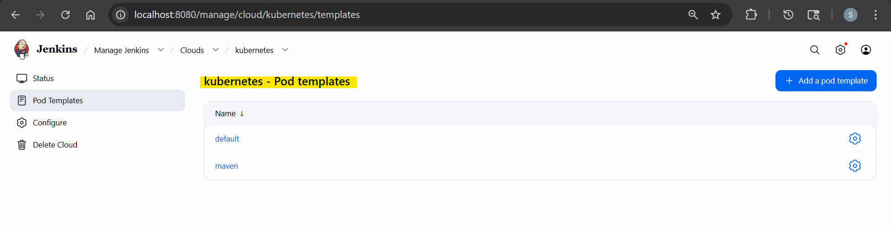
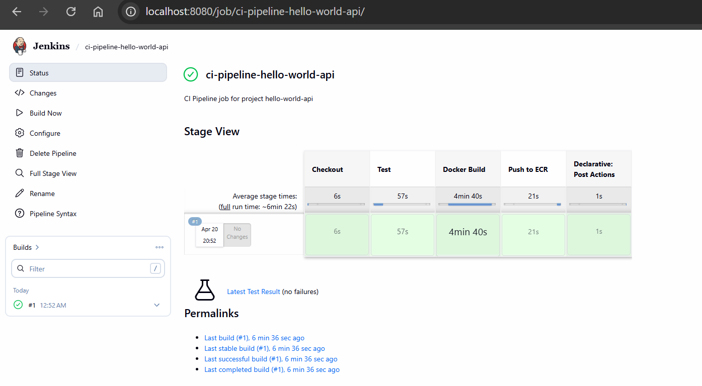
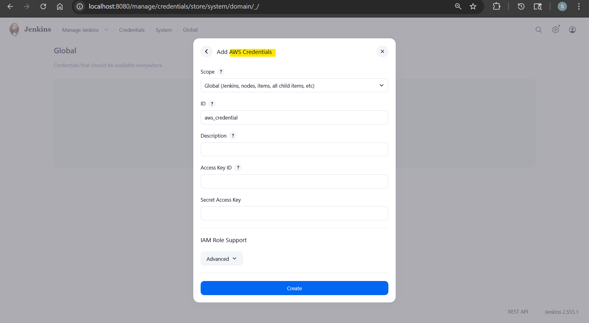

# Jenkins Demo: CI Pipeline to Push Image to ECR

- [Jenkins Demo: CI Pipeline to Push Image to ECR](#jenkins-demo-ci-pipeline-to-push-image-to-ecr)
  - [Overview](#overview)
  - [Jenkins Server Configuration](#jenkins-server-configuration)
  - [Pipeline Stages](#pipeline-stages)
  - [AWS ECR and IAM](#aws-ecr-and-iam)

---

## Overview

This project demonstrates a simple CI pipeline using **Jenkins**, **Docker**, and **AWS ECR** for a simple Spring Boot REST API image.

```txt
                 ┌─ Kubernetes Cluster ─────────────────────────────────────────────────────────────┐
                 │                                                                                  │
Git Push ───► Jenkins Controller ───► create pod agent (label: agent-maven)                         │
                 │                                                                                  │
                 │        ┌─ Pod Agent ──────────────────────────────────────────────────────────┐  │
                 │        │                                                                      │  │
                 │        │  ┌─ maven container ───────────────┐   ┌─ dind container ─────────┐  │  │
                 │        │  │                                 │   │                          │  │  │
                 │        │  │  Job: Checkout                  │   │  Job: Docker Build       │  │  │
                 │        │  │  Job: Test                      │   │  Job: Tag Image          │  │  │
                 │        │  │                                 │   │  Job: Push to ECR        │  │  │
                 │        │  │                                 │   │  Job: Cleanup            │  │  │
                 │        │  └─────────────────────────────────┘   └──────────────────────────┘  │  │
                 │        │                                                                      │  │
                 │        └──────────────────────────────────────────────────────────────────────┘  │
                 │                                                                                  │
                 └──────────────────────────────────────────────────────────────────────────────────┘
                                                                  │
                                                                  ▼
                                                       Amazon ECR Repository
```

---

## Jenkins Server Configuration

- Jenkins is deployed on `Kubernetes` using **`Helm`**
- Jenkins is configured using **`JCasC`**
- JCasC is used to define:
  - required plugins
  - pipeline job
  - `Kubernetes pod template` for pipeline execution

- Benifits:
  - keeps the Jenkins configuration **declarative** and **reproducible**.



---

## Pipeline Stages

```txt
Checkout → Test → Docker Build → Push to ECR (main/master only) → Post/Cleanup
```

- **Checkout**
  retrieve source code from the repository
- **Test**
  run mvn test
- **Docker Build**
  build the application image with Docker
- **Push to ECR**
  authenticate to AWS securely
  push image only from the main or master branch
- **Post/Cleanup**
  archive test results
  clean temporary resources



---

## AWS ECR and IAM

- `Jenkins` connects to AWS using a **dedicated identity**
- **Permissions are limited** to the minimum required for pushing images to `ECR`
- Credentials are managed securely through Jenkins **using the `aws-credentials` plugin**
- No AWS secrets are hardcoded in the repository or pipeline code

- Image push includes a simple tagging strategy, such as:
  - commit SHA tag
  - build number tag
  - latest for main or master branch only


